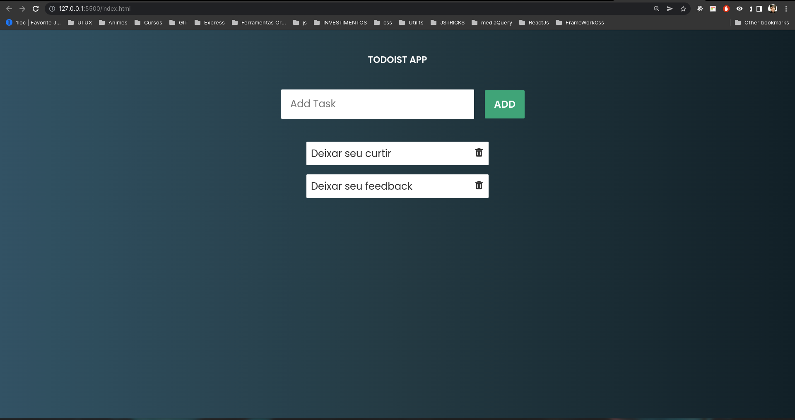

## 📄 Descrição

Todoist App - Aplicação de adição de tarefas.

### <a href="https://todoistsimplejs.netlify.app/">Acesse a aplicação</a>

## 📑 Observação

Desafio com o intuito de por em prática HTML5, CSS3 e JAVASCRIPT.

# Visão da aplicação

## 💻 Tecnologias utilizadas

- `HTML5`
- `CSS3`
- `JavaScript`

## 🧑‍💻 Criador

<table>
  <tr>
    <td align="center">
      <a href="https://github.com/guusfelix2015">
         
        
          <b>Gustavo Felix</b>
        
      </a>
    </td>
  </tr>
</table>
